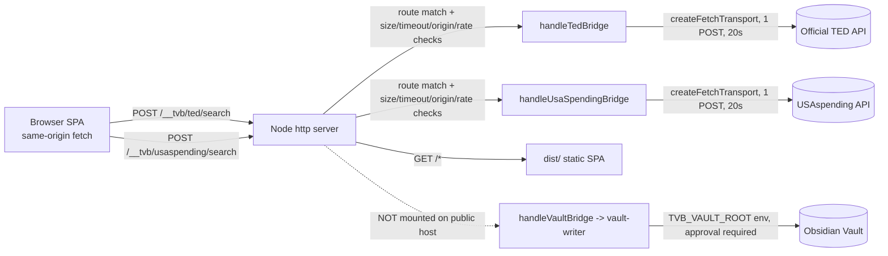

# Phase 12 — Production Bridge Hosting Assessment

**Date/time:** 2026-10-09, ≈11:22–11:32 IST
**Type:** assessment and design only. **No code changed. Nothing deployed. No external requests. No
Vault writes.** Every "claim" below is separated from "verified fact".

Endpoints in scope: `POST /__tvb/ted/search`, `POST /__tvb/usaspending/search`
(and, for boundary completeness, the vault write bridge `POST /__tvb/vault/{preview,write}`).

---

## 1. File-level architecture findings

**Verified facts (reusable, framework-agnostic):**
- `src/live-source/ted-bridge/handler.ts:125` `handleTedBridge(value, options)` and
  `src/live-source/usaspending-bridge/handler.ts:112` `handleUsaSpendingBridge(value, options)` are
  plain async functions: they take a request object and return `{ httpStatus, body }`
  (`TedBridgeResult` / `UsaSpendingBridgeResult`). **No Vite, Connect, or `http` types.**
- `*.contract.ts` (`ted-bridge/contract.ts`, `usaspending-bridge/contract.ts`) are dependency-free
  (types + a path constant) and are explicitly the only slice the browser may import.
- Both handlers validate the body themselves (`buildRequest`), build the query with the real adapter
  planner (`buildTedQueryPlan` / `buildUsaSpendingQueryPlan`), and perform exactly one outbound POST via
  `createFetchTransport()` (`src/live-source/fetch-transport.ts:23`) to a **fixed** endpoint
  (`TED_SEARCH_ENDPOINT` / `USA_SPENDING_SEARCH_ENDPOINT`). Transport has a hard 20 s timeout
  (`fetch-transport.ts:24`), no retries, no caching, no auth to the source.
- `createFetchTransport` is injected (`options.transport`), so tests already run the handlers with a
  fake transport.

**Verified Vite-specific surface (thin):**
- `ted-bridge/plugin.ts`, `usaspending-bridge/plugin.ts`, `vault-bridge/plugin.ts` are ~80-line Connect
  middlewares. Each does: match path → 405 if not POST → read raw body → `JSON.parse` → call the
  handler → `send(res, status, body)`. They import `vite` types (`Plugin`, `Connect`) and register via
  `configureServer` / `configurePreviewServer` (`vite.config.ts:18` mounts all three).
- The plugin middleware logic (path routing, body read, JSON parse, error → 500 envelope) is
  **duplicated** across the three plugins.

**Verified entry points:** the app is a client-only Vite SPA (`src/main.tsx`, `index.html`). There is
**no** server entry module and no `serve` script — `package.json` has only `dev`/`preview` (Vite) and
`build`/`typecheck`/tests. Browser callers: `live-discovery.ts:85` and `live-funding-discovery.ts:78`
(fetch the live bridges same-origin); `components/review/VaultWritePanel.tsx:37` (fetches the vault
bridge).

**Verified boundary guards:** `src/vault-writer/boundary.test.ts` 19a–19e assert only
`import/cli.ts`, `import/snapshot.ts`, `vault-writer/writer.ts` hold write primitives (19a); the
`automation/*` engines are filesystem-free (19b/19c); `writer.ts` has no network/clock/random (19d);
and `components/pages/data/analytics/app/hooks` cannot import `vault-writer` (19e).

**Conclusion:** the business logic is already host-agnostic. Only the transport *adapter* (Vite
middleware) is Vite-specific. A production host can call the existing handlers unchanged.

## 2. Hosting contract (per endpoint)

### `POST /__tvb/ted/search` and `POST /__tvb/usaspending/search`
| Aspect | Verified behavior |
|---|---|
| Method / path | `POST`; other methods → **405** `{error:'method not allowed', expected:'POST'}` |
| Request body | JSON object `{ runId, companyId, keyword, publishedSince, limit, requestedAt }` |
| Validation | `runId`/`companyId`/`requestedAt` required non-empty strings; `keyword` required non-empty; `limit` number → `Math.floor` else default 10; `publishedSince` optional. Faults → **400** with explicit `errors` (`malformed_request` / `invalid_request`). **`limit` is not clamped to 1–100 by the handler** — the contract comment says the *source* clamps. |
| Response | `{ok:true,status,body:string}` on upstream 2xx (**200** wrapper, real upstream `status` preserved); `{ok:false,status,body,errors}` on upstream non-2xx (wrapper `httpStatus` = the upstream status) or transport throw (**502** `source_failure`). Raw upstream body returned unchanged as a string. |
| Timeout / errors | Outbound 20 s hard abort (`fetch-transport.ts:30`); on throw → 502. Unexpected middleware error → **500** `bridge_failure` (`plugin.ts:59`). |
| Input limits | **None enforced server-side**: no max body size (`readBody` concatenates unbounded, `plugin.ts:29`), no `Content-Type` check, no keyword length cap, no inbound request timeout, no concurrency limit. |
| Read-only | **Yes.** One outbound POST, no writes, no document downloads. |
| Filesystem / Vault path | **None.** The live handlers import no `node:fs` and no `vault-writer`; the source endpoint is fixed server-side, so a client cannot redirect the server. |

### `POST /__tvb/vault/preview`, `POST /__tvb/vault/write` (context)
| Aspect | Verified behavior |
|---|---|
| Method / path | `POST`; else 405 (`vault-bridge/plugin.ts:50`) |
| Body | `{ item }` (parsed object) |
| Vault root | **Exclusively** `process.env.TVB_VAULT_ROOT` on the server, per request (`plugin.ts:66`); never from the body/query. Unset → honest refusal, no default dir. |
| Capability | `preview` is dry-run; `write` reaches `vault-writer/writer.ts` and requires a dated human-approval envelope (`writer.ts:219`), writes with `flag:'wx'` (`writer.ts:494`). **This endpoint can write to the filesystem by design.** |
| Read-only | Preview: yes. Write: **no — it is the single controlled write path.** |

**What must change for a production host (live bridges):** replace the Vite `Connect` middleware with
a host's route table that calls the same handlers; add the missing server-side controls (size limit,
timeout, origin/authorization, rate limit). **What must stay unchanged:** the handlers, contracts,
adapters, transport, fixed endpoints, and the "never convert failure into empty success" behavior.

## 3. Hosting options

| Criterion | A. Small Node `http` server (recommended) | B. Managed serverless function |
|---|---|---|
| Code reuse | Handlers + contracts reused verbatim; only the ~40-line adapter is new | Same handlers, but each function needs its own adapter + body decoding |
| Config / deps | **Zero new deps** (`node:http`); one entry + `serve` script | Adds platform config; may add runtime deps |
| Deployment | Single Node process serving `dist/` + `/__tvb/*`; needs TLS/process mgmt (reverse proxy) | Managed TLS/scale; but couples SPA + functions |
| Timeout fit | 20 s outbound fits fine | **Risk:** some platforms cap requests at 10 s (e.g. Netlify/Vercel Hobby), truncating slow source calls |
| Testing | Deterministic: start server, `fetch` it; existing handler tests unchanged | Requires emulator/sandbox; slower, less deterministic |
| Secrets | None for live bridges; vault bridge needs `TVB_VAULT_ROOT` (see §4) | Same, plus platform secret store |
| Accidental Vault access | Live server simply omits the vault routes → no write capability | Same, if vault routes are not deployed; but shared runtime makes it easier to leak |
| Complexity | Lowest, matches existing TypeScript/Node project | Higher; serverless is a poor fit for a long-running read-only proxy + SPA |

**Recommendation:** **Option A** — one small `node:http` server that serves `dist/` and mounts the
live bridges by calling the existing handlers. No framework/dependency added. Deploy TLS/process
management via an existing reverse proxy (nginx/Caddy/systemd) if needed — also no code dependency.

## 4. Security review

| Control | Status | Notes / proposed control |
|---|---|---|
| Origin / CORS | **Missing** | No `Access-Control-*` headers anywhere (grep found none). Works only because the SPA and bridges are same-origin. **CORS is not authorization** — if a separate origin is needed, add a strict allowlist *and* a server-side check. |
| Input validation | **Partial** | Required fields + keyword present (`handler.ts`), but **`limit` unclamped**, no keyword length cap. Add clamp `1..100` and a max keyword length. |
| Request size limit | **Missing** | `readBody` reads unbounded into memory → DoS. Add `Content-Length`/streaming cap (e.g. 8–16 KB) with 413. |
| Content-Type enforcement | **Missing** | Accepts any body; add `application/json` requirement. |
| Timeout | **Partial** | Outbound 20 s present; **no inbound/overall timeout**, **no concurrency cap**. Add an overall request timeout + limited concurrency. |
| Error responses | **Good** | Explicit 400/405/502/500 with `errors[]`; failures never become empty successes. |
| Rate limiting / abuse | **Missing** | No rate limit; each request triggers a real outbound source call → upstream abuse risk. Add per-client rate limiting. |
| Secrets | **Good (live)** | TED/USAspending need no credentials. Vault bridge requires `TVB_VAULT_ROOT` (a write capability) — must **not** be set on any publicly reachable instance. |
| FS / Vault exposure | **Good if scoped** | Live handlers have no FS/Vault path; writers are quarantined (boundary 19a/19e). The **vault bridge is the one endpoint that writes** — do not mount it on a public host. |
| Restricting clients beyond CORS | **Missing** | Add server-side origin allowlist, a shared-secret header/token, and/or network allowlisting; put the write bridge behind authentication, separate audience, or a non-public listener. |

## 5. Recommended architecture + request flow

Single Node process: serves the built SPA from `dist/` and mounts two (optionally three) routes that
call the existing handlers. Extract the duplicated middleware body into one reusable
`createBridgeListener(route → handler, limits)` so the Vite plugin and the production server share one
code path (no logic duplication).

Key invariants preserved: fixed upstream endpoints; read-only single outbound POST; raw status/body
returned; failure ≠ empty success; the write path stays out of the public host.

## 6. Minimum implementation phases and tests

**Phases (each one small, no new deps):**
1. Extract a framework-agnostic request listener with size/timeout/origin/rate controls; keep the Vite
   plugin delegating to it.
2. Add a `node:http` server entry (static `dist/` + live bridge routes); no vault route.
3. Add origin/authorization + rate-limit config; wire deployment (reverse proxy, TLS) separately.
4. (Only if needed) a separately authenticated vault-write service — never co-hosted publicly.

**Minimum deterministic tests before exposure:**
- valid request → expected response envelope (200 wrapping upstream status / body).
- invalid input (missing `runId`/`companyId`/`requestedAt`, blank keyword) → 400 with `errors`.
- malformed JSON → 400/handled (not 500 leak).
- upstream timeout / non-2xx → 502 / forwarded status; **never** an empty success.
- request-size limit → 413; oversized body rejected before handler.
- origin/access policy → disallowed origin/absent token rejected.
- regression: existing Vite dev/preview route still works (`qa/ted-live.spec.ts`, `qa/funding-live.spec.ts`).
- proof the hosted bridge cannot write: assert the production server module has no route to
  `vault-writer` and set no `TVB_VAULT_ROOT` (extend the spirit of `boundary.test.ts` 19a/19e).

## 7. Unresolved questions
- Is the deployment expected to be strictly same-origin (SPA + bridges on one host)? If not, the
  origin/CORS/auth design must be decided before implementation.
- Is the vault-write bridge ever intended to be reachable in production? If yes, it needs a separate
  authenticated host and an explicit threat model.
- What request rate/concurrency ceilings are acceptable to the upstream sources? (No rate policy exists
  today.)

## 8. Safety confirmation
- **No code was changed**; no dependencies added; nothing deployed.
- **No external HTTP requests or live discovery** were performed; **no Vault writes**; the generated
  `opportunity-data.json` was not modified.
- No credentials, tokens, or secrets were added to the repository.
- Only this file was written: `qa/phase12-report.md`.
